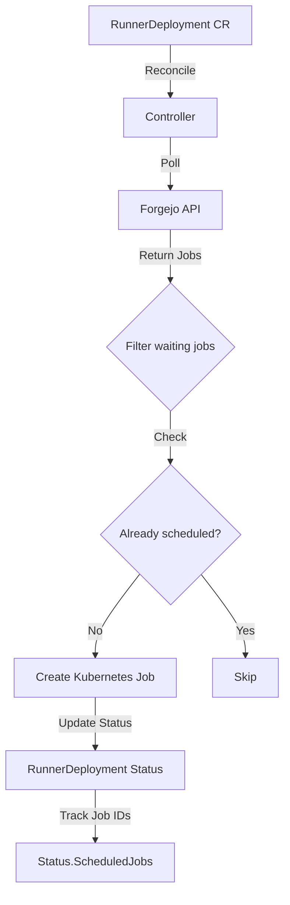

# Forgejo Act Runner Controller

o Actions Runner Controller Implementation Plan

## Overview

The controller will poll Forgejo's Actions API for pending jobs and create Kubernetes Jobs to execute them. Each `RunnerDeployment` CRD instance represents a connection to a Forgejo organization, polling for jobs matching specific labels.

## Architecture Flow

## Implementation Details

### 1. Update RunnerDeployment CRD Spec

**File**: [`api/v1alpha1/runnerdeployment_types.go`](api/v1alpha1/runnerdeployment_types.go)

Add fields to `RunnerDeploymentSpec`:

- `ForgejoServer` (string, required): Base URL (e.g., "https://git.cloud.danmanners.com")

- `Organization` (string, required): Organization name (e.g., "faro")

- `Labels` (string, required): Comma-separated labels filter (e.g., "docker" or "ubuntu-22.04:docker://node:20-bullseye")

- `TokenSecretRef` (SecretReference, required): Reference to Kubernetes Secret containing the Forgejo API token

- `PollInterval` (metav1.Duration, optional): Polling interval (default: 30s)

- `JobTemplate` (PodTemplateSpec, optional): Template for Kubernetes Jobs (allows customization of runner image, resources, etc.)

### 2. Update RunnerDeployment Status

**File**: [`api/v1alpha1/runnerdeployment_types.go`](api/v1alpha1/runnerdeployment_types.go)

Add to `RunnerDeploymentStatus`:

- `LastPollTime` (metav1.Time): Timestamp of last successful poll

- `ScheduledJobs` ([]ScheduledJob): List of currently scheduled Forgejo job IDs with their Kubernetes Job references

- `ObservedGeneration` (int64): Track which generation was last reconciled

Type `ScheduledJob` should include:

- `ForgejoJobID` (int64): The Forgejo job ID

- `KubernetesJobName` (string): Name of the created Kubernetes Job

- `ScheduledAt` (metav1.Time): When the job was scheduled

### 3. Forgejo API Client Package

**New Package**: `internal/forgejo/client.go`

Create a client package to interact with Forgejo API:

- Struct to hold server URL and auth token

- Function to fetch jobs: `GetPendingJobs(ctx, org, labels) ([]Job, error)`

- Parse JSON response into Job struct matching Forgejo API format

- Handle authentication with token header

- Error handling and retries

### 4. Controller Reconciliation Logic

**File**: [`internal/controller/runnerdeployment_controller.go`](internal/controller/runnerdeployment_controller.go)

Implement the reconciliation loop:

1. **Fetch RunnerDeployment**: Get the current RunnerDeployment resource

2. **Load Secret**: Retrieve the token from the referenced Secret

3. **Poll Forgejo API**: Call the Forgejo client to get pending jobs

4. **Filter Waiting Jobs**: Only process jobs with status "waiting"

5. **Check for Duplicates**: For each waiting job:

- Check if job ID exists in `Status.ScheduledJobs`

- Check if Kubernetes Job with matching label already exists

6. **Create Kubernetes Jobs**: For new jobs:

- Generate unique Kubernetes Job name (e.g., `forgejo-job-{id}-{hash}`)

- Create Job using batch/v1 API

- Set labels/annotations linking to Forgejo job ID

- Use JobTemplate from spec (or default act-runner image)

7. **Update Status**: Record scheduled jobs in RunnerDeployment status

8. **Cleanup**: Periodically clean up completed jobs from status tracking

### 5. Kubernetes Job Structure

Each Kubernetes Job should:

- Use `batch/v1` Job resource

- Be labeled with Forgejo job ID for tracking

- Run act-runner or configured container image

- Include environment variables or config needed to connect to Forgejo and claim the job

- Be one-time execution (restartPolicy: Never or OnFailure)

### 6. RBAC Permissions

**File**: [`config/rbac/role.yaml`](config/rbac/role.yaml) (update existing)

Add permissions for:

- `batch` API group: `jobs` (create, get, list, watch, update, patch, delete)

- `core` API group: `secrets` (get, list) for reading token secrets

- `core` API group: `pods` (get, list, watch) for monitoring job execution

### 7. Default Job Template

If no `JobTemplate` is provided in spec, use a sensible default:

- Image: Latest act-runner image

- Environment variables for Forgejo connection

- Resource limits (to be determined)

## Key Design Decisions

1. **Job Tracking**: Use combination of `Status.ScheduledJobs` for observability and label-based lookup of existing Kubernetes Jobs for reliability

2. **Polling Strategy**: Periodic polling with configurable interval (default 30s)

3. **Duplicate Prevention**: Check both status field and existing Kubernetes Jobs before scheduling

4. **Runner Execution**: Jobs will use act-runner to claim and execute Forgejo jobs (standard pattern)

5. **Cleanup**: Track job lifecycle but rely on Kubernetes Job completion; periodic cleanup of status tracking

## Testing Considerations

- Unit tests for Forgejo API client

- Controller tests with fake client

- Integration tests with mock Forgejo server

- E2E tests (future)

## Open Questions / Future Enhancements

- How exactly does act-runner claim jobs? (Need to research act-runner API)

- Should we support webhooks in the future for real-time updates?

- Resource limits and node selectors for Jobs
- Handling job failures and retries