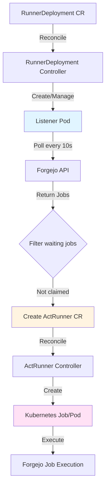

# Forgejo Actions Runner Controller - Two-Tier Architecture

## Overview

The controller uses a three-tier architecture:

1. **RunnerDeployment**: Manages a long-running "listener" pod that polls Forgejo API

2. **Listener Pod**: Polls Forgejo every 10s (default) for pending jobs and creates ActRunner CRDs

3. **ActRunner**: Individual CRD representing a single Forgejo job, creates Kubernetes Job/Pod to execute it

This design provides better separation of concerns, observability, and follows Kubernetes operator patterns.

## Architecture Flow



## Implementation Details

### 1. RunnerDeployment CRD

**File**: [`api/v1alpha1/runnerdeployment_types.go`](api/v1alpha1/runnerdeployment_types.go)

**RunnerDeploymentSpec** fields:

- `ForgejoServer` (string, required): Base URL (e.g., "https://git.cloud.danmanners.com")

- `Organization` (string, required): Organization name (e.g., "faro")

- `Labels` (string, required): Labels filter (e.g., "docker" or "ubuntu-22.04:docker://node:20-bullseye")

- `TokenSecretRef` (corev1.SecretReference, required): Reference to Secret containing Forgejo API token

- `PollInterval` (*metav1.Duration, optional): Polling interval for listener (default: 10s)

- `ListenerTemplate` (corev1.PodTemplateSpec, optional): Template for listener pod (allows customization)

- `RunnerTemplate` (corev1.PodTemplateSpec, optional): Template for runner pods/jobs (used by ActRunner to create Kubernetes Jobs)

**RunnerDeploymentStatus** fields:

- `ListenerPodName` (string): Name of the created listener pod

- `LastPollTime` (metav1.Time): Last successful poll time (from listener)

- `ActiveActRunners` (int32): Count of active ActRunner resources

- `ObservedGeneration` (int64): Track reconciliation

### 2. ActRunner CRD (New)

**New File**: [`api/v1alpha1/actrunner_types.go`](api/v1alpha1/actrunner_types.go)

Create a new CRD for individual runners:**ActRunnerSpec** fields:

- `ForgejoJobID` (int64, required): The Forgejo job ID

- `ForgejoServer` (string, required): Forgejo server URL (inherited from RunnerDeployment)
- `Organization` (string, required): Organization name

- `TokenSecretRef` (corev1.SecretReference, required): Token for claiming/executing job

- `JobData` (JobData, required): Full job payload from Forgejo API (id, repo_id, owner_id, name, needs, runs_on, task_id, status)

- `JobTemplate` (corev1.PodTemplateSpec, optional): Template for execution pod/job (inherited from RunnerDeployment RunnerTemplate when ActRunner is created)

**ActRunnerStatus** fields:

- `Phase` (string): Current phase (Pending, Running, Succeeded, Failed)

- `KubernetesJobName` (string): Name of created Kubernetes Job

- `StartedAt` (metav1.Time): When job execution started

- `CompletedAt` (metav1.Time): When job execution completed

- `Conditions` ([]metav1.Condition): Detailed conditions

**Owner Reference**: ActRunner should have ownerReference pointing to RunnerDeployment for cleanup.

### 3. Forgejo API Client Package

**New Package**: `internal/forgejo/client.go`Create a shared client package:

- `Client` struct with server URL and auth token

- `GetPendingJobs(ctx, org, labels) ([]Job, error)`: Fetch jobs from `/api/v1/orgs/{org}/actions/runners/jobs?labels={labels}`

- `Job` struct matching Forgejo API response (id, repo_id, owner_id, name, needs, runs_on, task_id, status)

- Parse JSON and handle authentication
- Used by both listener pod code and controller

### 4. Listener Pod Implementation

**New Package**: `internal/listener/main.go`

Create a standalone program that runs in the listener pod:

- Load configuration from environment variables (ForgejoServer, Organization, Labels, Token)
- Poll Forgejo API every 10s (configurable via env var) for pending jobs with status "waiting"
- For each waiting job returned:
  - **Check if already claimed by local runner**: Query Kubernetes API for existing ActRunner resources with matching ForgejoJobID in the same namespace
  - **Duplicate prevention**: Only create new ActRunner if no existing ActRunner found for this job ID
  - If not claimed locally, create ActRunner CRD resource with JobTemplate copied from RunnerDeployment RunnerTemplate
- This ensures jobs are not claimed multiple times by different runners in the same cluster

**Important**: The listener pod needs access to the RunnerDeployment resource to read the RunnerTemplate. This can be done via:
- Pass RunnerTemplate via environment variable/configmap when listener is created, OR
- Listener reads RunnerDeployment via Kubernetes API (requires RBAC)

- Handle errors and retries gracefully

- Exit gracefully on shutdown

The listener needs Kubernetes client to create ActRunner resources. Use controller-runtime client or kubernetes clientset.

**Deployment**: Listener runs as a Deployment (single replica) managed by RunnerDeployment controller.

### 5. RunnerDeployment Controller

**File**: [`internal/controller/runnerdeployment_controller.go`](internal/controller/runnerdeployment_controller.go)

Reconciliation logic:

1. **Fetch RunnerDeployment**: Get current resource

2. **Load Secret**: Retrieve token from referenced Secret

3. **Create/Update Listener Deployment**: 
- Use `ListenerTemplate` from spec or default template
  - Inject Forgejo connection details as environment variables (ForgejoServer, Organization, Labels, Token)
  - Inject RunnerTemplate (via ConfigMap or environment variable) so listener can copy it to ActRunner resources
  - Set up Kubernetes client (ServiceAccount with RBAC for creating ActRunners and reading RunnerDeployment)
- Configure polling interval

4. **Monitor Listener**: Check listener pod health

5. **Update Status**: Record listener pod name and status

6. **Cleanup**: When RunnerDeployment deleted, clean up listener and associated ActRunners

The controller should watch both RunnerDeployment and the listener Deployment/Pod.

### 6. ActRunner Controller

**New File**: [`internal/controller/actrunner_controller.go`](internal/controller/actrunner_controller.go)

Reconciliation logic:

1. **Fetch ActRunner**: Get current resource

2. **Check Phase**: 

- If Pending: Create Kubernetes Job

- If Running: Monitor Kubernetes Job status

- If Succeeded/Failed: Mark complete, update status

3. **Create Kubernetes Job**:

- Generate unique Job name (e.g., `actrunner-{job-id}-{hash}`)

- Use `JobTemplate` from spec or default

- Set labels/annotations with Forgejo job ID

- Configure container to connect to Forgejo and claim/execute the job

- Use act-runner image or configured image

4. **Monitor Job**: Watch Kubernetes Job status and update ActRunner status

5. **Update Status**: Track phase, conditions, timestamps

6. **Cleanup**: Optionally delete completed Kubernetes Jobs after retention period

### 7. Kubernetes Job Structure

Each Kubernetes Job created by ActRunner controller:

- Use `batch/v1` Job resource (or Pod with restartPolicy: Never)

- Labeled with ActRunner name and Forgejo job ID

- Runs container image (default: act-runner)

- Environment variables:

- `FORGEJO_SERVER`: Server URL

- `FORGEJO_TOKEN`: API token (from Secret, via envFrom)
- `FORGEJO_JOB_ID`: Job ID to claim
- Other job-specific configuration

- One-time execution (restartPolicy: Never)

### 8. RBAC Permissions

**File**: [`config/rbac/role.yaml`](config/rbac/role.yaml)

**For RunnerDeployment Controller**:

- `apps` API group: `deployments`, `pods` (create, get, list, watch, update, patch, delete)

- `forgejo.actions.io` API group: `actrunners` (create, get, list, watch, update, patch, delete)

- `core` API group: `secrets` (get, list) for reading tokens

- `core` API group: `serviceaccounts` (create, get, update) for listener pod

**For Listener Pod** (ServiceAccount):

- `forgejo.actions.io` API group: `actrunners` (create, get, list, watch)
- `forgejo.actions.io` API group: `runnerdeployments` (get, list) for reading RunnerTemplate

**For ActRunner Controller**:

- `batch` API group: `jobs` (create, get, list, watch, update, patch, delete)

- `core` API group: `pods` (get, list, watch)

- `core` API group: `secrets` (get, list) for reading tokens

### 9. Default Templates

**Listener Pod Default**:

- Image: Controller image (sidecar pattern) or dedicated listener image

- Environment variables for Forgejo connection

- Kubernetes client configuration (ServiceAccount)

**Job Pod Default**:

- Image: Latest act-runner image

- Resource limits (TBD)

- Security context (TBD)

## Key Design Decisions

1. **Three-Tier Architecture**: RunnerDeployment → Listener Pod → ActRunner → Kubernetes Job

2. **Listener Pod**: Handles polling logic separately from controller, can scale independently

3. **ActRunner CRD**: Provides observability and declarative management of individual jobs

4. **Owner References**: ActRunners owned by RunnerDeployment for cascading deletion

5. **Duplicate Prevention**: Listener checks for existing ActRunners (local runners) before creating new ones, ensuring jobs are not claimed multiple times within the same cluster

6. **Polling**: Default 10s interval, configurable per RunnerDeployment

7. **Job Execution**: Kubernetes Jobs created by ActRunner controller, uses act-runner to claim and execute

## File Structure

```javascript
api/v1alpha1/
    - runnerdeployment_types.go (updated)
    - actrunner_types.go (new)
    - groupversion_info.go (updated to register ActRunner)

internal/
    - controller/
        - runnerdeployment_controller.go (updated)
        - actrunner_controller.go (new)
    - forgejo/
        - client.go (new)
    - listener/
        - main.go (new)

cmd/
    - main.go (updated to register ActRunner controller)
```

## Testing Considerations

- Unit tests for Forgejo API client
- Controller tests with fake clients for both controllers

- Integration tests for listener pod logic

- E2E tests with mock Forgejo server

- Test ActRunner creation and lifecycle

## Open Questions / Future Enhancements

- How does act-runner claim jobs? (Need to research act-runner API/implementation)

- Should listener pod be a Deployment or StatefulSet?

- Resource limits and node selectors for listener and job pods

- Retry logic for failed jobs

- Metrics and observability (Prometheus metrics)